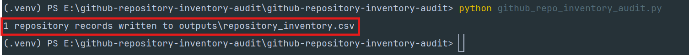
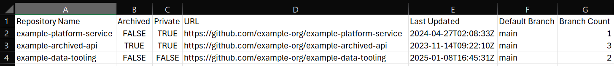

# 🔎 GitHub Repository Inventory Audit

This tool helps platform and engineering teams improve visibility across GitHub repositories by collecting metadata such as archive status, visibility, last updated date, default branch, and branch count.

# 🖥️ Terminal run

### The screenshot below shows the script running locally and generating the repository inventory CSV.



---

# 📄 Example CSV output

### The screenshot below shows the generated repository inventory output opened as a CSV.

Sensitive repository names, private URLs, or organization details have been sanitized before publishing.


---

# Why this project exists

In engineering organizations, GitHub repositories often grow quickly across teams, services, experiments, internal tools, and archived projects.

Over time:

* repository ownership becomes unclear
* stale repositories remain active
* archived repositories are not consistently tracked
* private and public visibility can become difficult to review
* default branch standards may drift
* branch sprawl can increase operational noise
* engineering leaders lack a simple inventory view

This tool provides a lightweight way to collect repository metadata from a GitHub organization and export it into a CSV report for review.

The goal is not only to list repositories, but to support better developer-platform visibility, governance, and operational decision-making.

---

# What this tool does

The script connects to the GitHub REST API, retrieves repositories for a selected GitHub organization, collects repository metadata, counts branches for each repository, and exports the results to CSV.

It can be used to:

* create a repository inventory
* identify archived repositories
* review private/public repository visibility
* check default branch naming
* identify repositories with many branches
* support developer-platform governance
* support engineering operations reviews
* generate lightweight reporting for repository cleanup
* Features
* GitHub organization repository inventory
* API pagination support
* CSV export
* Repository archive status
* Repository private/public visibility
* Repository URL export
* Last updated timestamp
* Default branch reporting
* Branch count per repository
* Environment-variable based authentication
* Local output folder generation
* Lightweight Python implementation

---

# Architecture and flow

        Local machine / CI runner
                |
                |  GitHub token via environment variable
                v
        Python inventory script
                |
                |  GitHub REST API
                v
        Organization repositories
                |
                v
        Repository metadata collection
                |
                +--> Branch count lookup
                |
                v
        CSV report export

---

# GitHub token permissions

This tool requires a GitHub token that can read repository metadata for the organization being audited.

For public repositories, minimal read access may be enough.

For private organization repositories, the token must have permission to read private repository metadata.

Recommended approach:

use a dedicated token
grant the least permissions needed
avoid using personal tokens with excessive access
never commit tokens to GitHub
rotate tokens if they are exposed

**⚠️ Do not hardcode tokens in the script.**

---


# Requirements

* Python 3.9+
* GitHub Personal Access Token
* Access to a GitHub organization

## ▶️ Local setup

Create and activate a virtual environment.

Windows PowerShell
```bash
python -m venv .venv
.\.venv\Scripts\Activate.ps1
```

macOS / Linux
```bash
python -m venv .venv
source .venv/bin/activate
```

Install dependencies:

```bash
pip install -r requirements.txt
```

Verify that `requests` is installed:
```bash
python -c "import requests; print('requests installed successfully')"
```
Expected output:
`requests installed successfully`

## Environment variables

The script reads configuration from environment variables.

Required variables:

GITHUB_TOKEN
GITHUB_ORG

Windows PowerShell
```bash
$env:GITHUB_TOKEN="your_github_token_here"
$env:GITHUB_ORG="your_org_name_here"
```

macOS / Linux
```bash
export GITHUB_TOKEN="your_github_token_here"
export GITHUB_ORG="your_org_name_here"
```
**⚠️ Do not commit these values to GitHub.**

# Run the script:
```bash
python github_repo_inventory_audit.py
```
The script writes output to:

`outputs/repository_inventory.csv`

Expected terminal output:

`1 repository records written to outputs/repository_inventory.csv`

The number of records will depend on how many repositories the token can access in the selected organization.

---

# Security notes

**⚠️ Do not commit:**

* GitHub personal access tokens
* .env files
* private organization names if sensitive
* private repository URLs
* real generated inventory reports
* internal repository names that reveal systems, products, or clients


`outputs/` contains local generated audit reports and is ignored by Git.

`examples/ `contains sanitized sample output safe to commit.

---

# Platform engineering perspective

This project reflects a common developer-platform problem:

As repositories scale across teams, visibility and governance become harder to manage manually.

A lightweight inventory tool can help engineering teams:

* improve repository visibility
* identify stale or archived repositories
* support repository cleanup efforts
* review private and public visibility
* detect branch sprawl
* support internal platform governance
* create simple reporting for engineering reviews

The value is not only in the CSV output, but in the operating model it supports: visibility, ownership, governance, and maintainability across engineering platforms.

---

# Technology stack
* Python
* Requests
* GitHub REST API
* CSV reporting

---

### `Failed to fetch repositories`

This usually means one of the following:

* the organization name is incorrect
* the token does not have access to the organization
* the token has expired
* the organization requires SSO authorization
* GitHub API access is temporarily unavailable

Check the organization name and token permissions.

---

### Output CSV is empty

Possible causes:

* the organization has no repositories visible to the token
* the token does not have access to private repositories
* the wrong organization name was used

Try testing with an organization or account where you know the token has repository access.

--- 

# 👤 Author

Built with ☕ by Alex as a platform engineering project focused on GitHub repository visibility, governance, and developer-platform operations.

This project reflects a real engineering operations problem: understanding what repositories exist, how they are maintained, and where platform governance may need attention.

---
